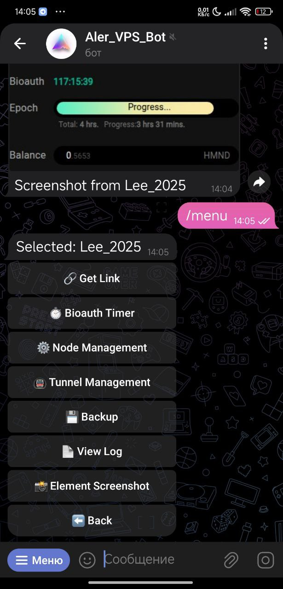
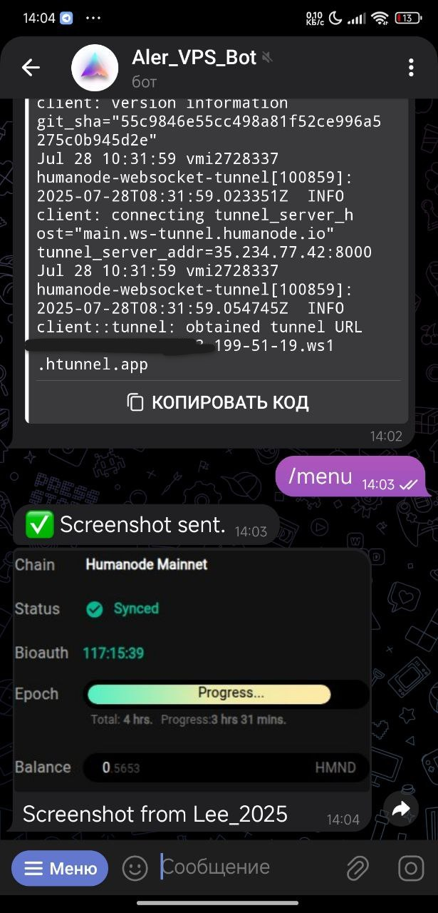
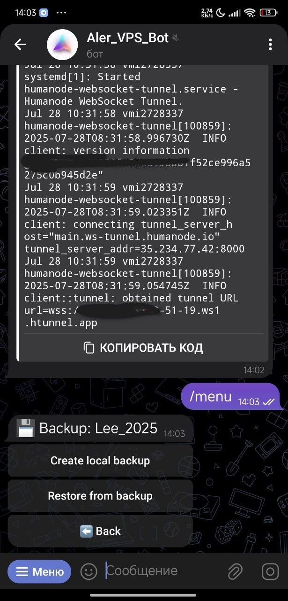
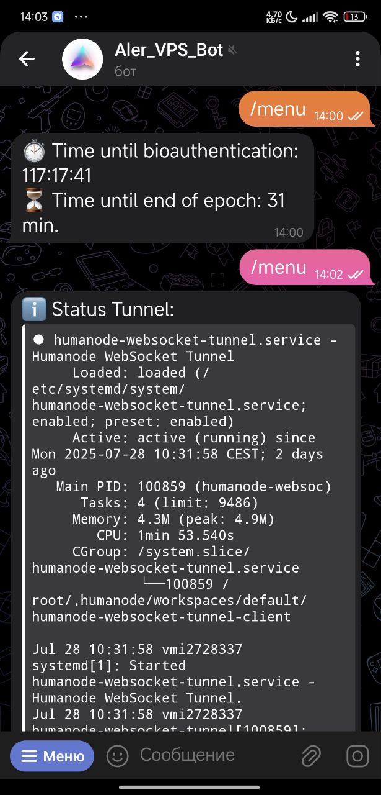
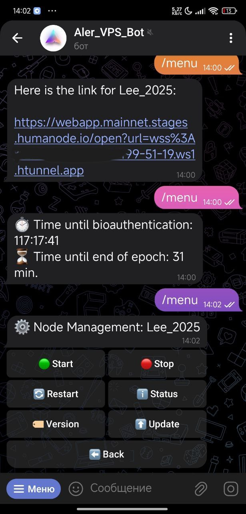

# Humanode Telegram Management Bot

This is a Telegram bot for managing and monitoring your Humanode nodes, featuring a fully automated installation process.

## Features

*   **Multi-Node Support**: Manage several nodes from a single bot.
*   **Node & Tunnel Management**: Start, stop, restart, and check the status of your services.
*   **Automated Monitoring**: Get timely notifications for bio-authentication.
*   **Automated Backups**: Create and restore node database.
*   **Node Updates**: Update your node to the latest version.
*   **Multi-language Support**: UI available in English and Ukrainian.

---

## 📸 Screenshots

Here is a glimpse of the bot's interface in action.

| Main Menu | Server Management |
| :---: | :---: |
|  |  |

| Node Management | Backup & Restore |
| :---: | :---: |
|  |  |

| Bio-authentication Timer |
| :---: |
|  |

---

## 🚀 Automated Installation

The installation is handled by an interactive script. It will guide you through the setup, ask for configuration details, and set up the bot as a system service.

**To install, run the following command:**
```bash
bash <(curl -sSL https://raw.githubusercontent.com/stalkerSumy/humanode-telegram-bot/main/install.sh)
```

---

## 🗑️ Automated Uninstallation

To completely remove the bot and its configuration from your system, use the uninstaller script.

**To uninstall, run the following command:**
```bash
bash <(curl -sSL https://raw.githubusercontent.com/stalkerSumy/humanode-telegram-bot/main/uninstall.sh)
```

---

## 🛠️ Managing the Bot Service

The bot runs as a `systemd` service. You can manage it with standard `systemctl` commands:

*   **Check the status:**
    ```bash
    sudo systemctl status humanode_bot
    ```

*   **View live logs:**
    ```bash
    sudo journalctl -u humanode_bot -f
    ```

*   **Restart the bot (e.g., after manual config changes):**
    ```bash
    sudo systemctl restart humanode_bot
    ```

*   **Stop the bot:**
    ```bash
    sudo systemctl stop humanode_bot
    ```

---

## ❤️ Support the Project

If you find this bot useful, please consider supporting its development:

- **EVM Networks (ETH, BSC, Polygon, etc.):**
  `0x5A1D23F27bd84dd3Bc02ecCAD3d48bEAFD60dF10`

- **Humanode (HMND):**
  `hmqxDrZmJzJwNoyCdnGFdmhAVvnH984j8gFJfc2fbQ7Qnjwnq`

---
Powered by **mr.Lee** and **Gemini**
